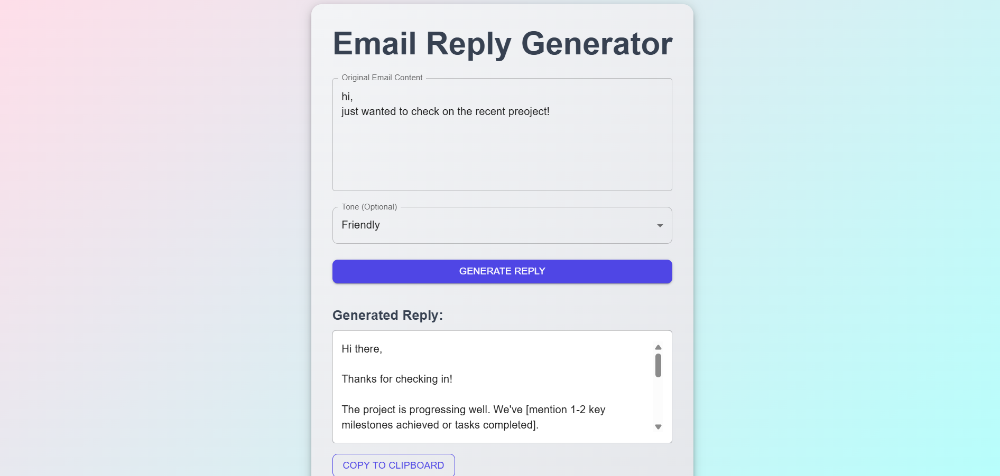
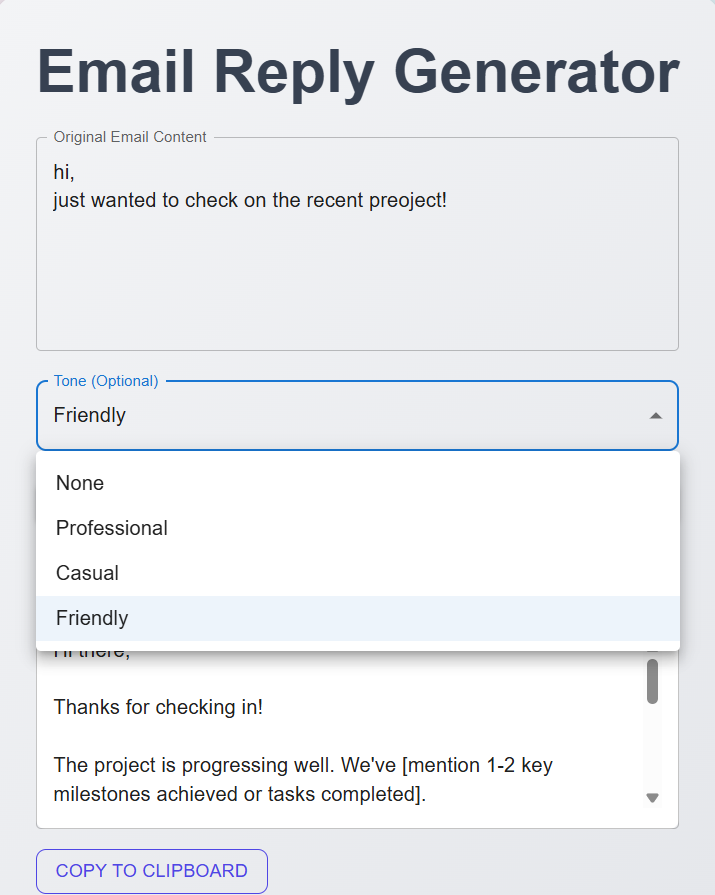

📧 AI Email Reply Generator
An AI-powered Email Reply Generator built with React + Vite on the frontend and Spring Boot on the backend. This tool allows users to input an email prompt and generate replies in three different tones: Friendly, Professional, or Casual.

📝 Overview
Dynamic Replies: Input any email prompt and get AI-generated replies in different communication styles.

Tone Selection: Choose from Friendly, Professional, or Casual tones for your responses.

Seamless Integration: Built using React + Vite for a fast UI and Spring Boot for AI-based processing.

🖼️ Screenshots

